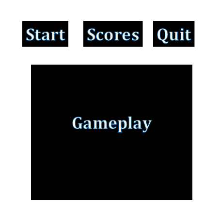

----
# Space Race

## Game "Things"

The things of Space Race are obstacles/enemies as well as a one powerup! Each enemy is different class of an enemy spaceship that the player must defeat.
 
  1. Drone
    * A purple unit that falls while moving horizontally across the screen.
    * Takes one shot to kill.
    * Worth 25 points.
  2. Praetorian
    * A green unit that falls toward the player's current location.
    * Takes three shots to kill.
    * Worth 75 points.
  3. Deathknight
    * A dark blue unit that stays in center Y of the screen while moving back and forth horizontally.
    * The Deathknight unleashes more Praetorian units toward the player.
    * Ten shots to kill.
    * Worth 300 points.
    
  4. Asteroid
    * Space rock that bounces of the walls horizontally.
    * One shot to kill.
    * Worth 10 points.
    
  5. Care package
    * Army supplies that double that points you get for a short period of time.
    
## Controls

  1. Click blue and red forcefields
    * Move between forcefields, left and right.
  2. Click ship
    * Shoot lasers at enemies.

## Score

  * To score, the player must kill as many enemies as they can. The game goes on forever, so the point of the game is to obtain the high score possible.
  * Killing bigger, badder units gives the user more points. It is pretty difficult to actually dodge the enemies, so the player must kill them.

## Lives

  * The player loses a life when it is hit by an enemy. A value for the number of lives is stored in the player class and decremented when a player is hit.
  * When every life is lost, the score is reset back to zero and the user's score is preserved in the high score class.

## Interface

  * The interface will be two horizontal layouts grouped inside a vertical layout.
  * The first horizontal layout will have 3 buttons:
    * A start button. This starts the game.
    * A quit button. Kills the program.
    * A high score button. Sees the highest scores the user got before losing all their lives.
  * The second horizontal layout will display the scene where the gameplay takes place.
  

 

